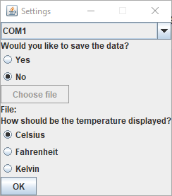
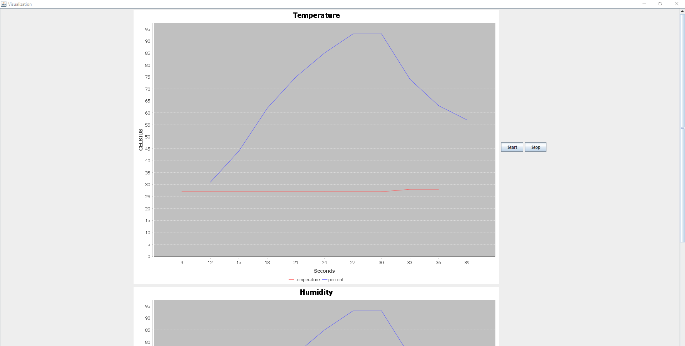
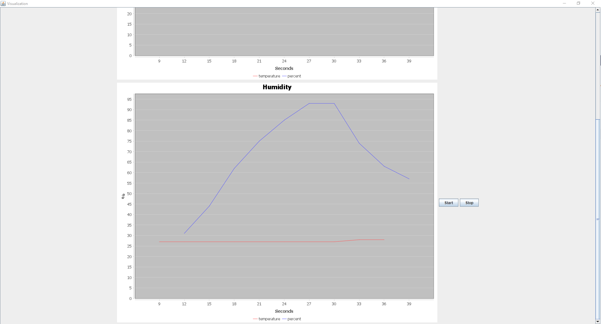
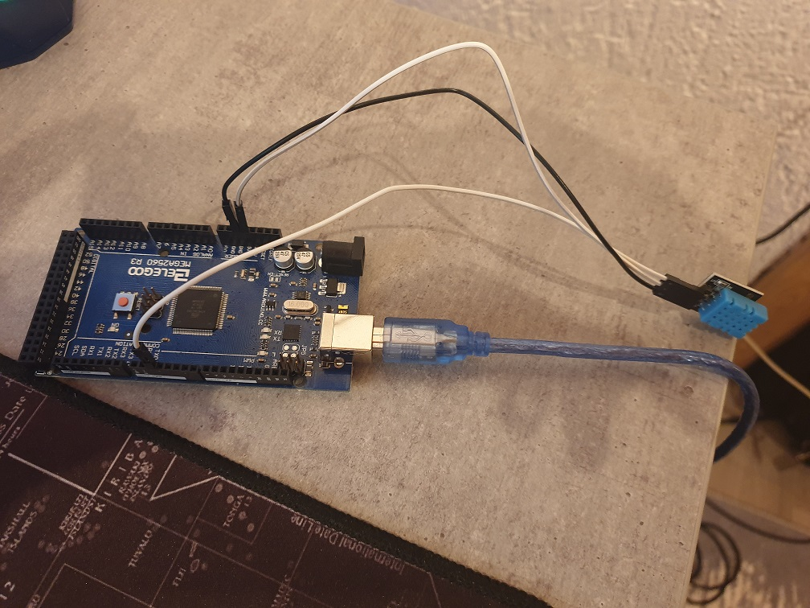

# Description

During this project I will be creating an Arduino project and an Java Project. 

The Arduino is getting the current temperature and the current humidity in the room. I am using the Mega 2560 processor and the sensor is the DHT11 Temperature and Humidity module. 

The Java Project gets the data through the serial port and displays it in a Graph. Furthermore the data can be stored in a database.

# Screenshots
## Settings Window

## Visualization Window

# Arduino

## Arduino Components
* 3x Male-Female Jumper Wires
* DHT11 Temperature and Humidity Module
* Arduino Mega
* USB Cable to connect the Arduino to a PC

## Wiring
* Connect the DHT11 Ground Pin to Ground
* Connect the DHT11 VCC Pin to 5V
* Connect the DHT11 Data Pin Digital 2

# Software
* Eclipse
* Eclipse Plugins: Java, CDT, Arduino Plugin

# Technology Stack
* Programming Languages: C++, Java 8
* SQL

## Java Libraries
* jSerialComm
* Java Swing
* JFreeChart
* JDBC

## Arduino Libraries
* [DHT driver library which was created by Ole Wolf](https://github.com/olewolf/DHT_nonblocking)

# What I've learned
* Improved in Java, C++
* Improved in Coding for the Arduino
* Improved in using Java Swing
* Learned JFreeChart
